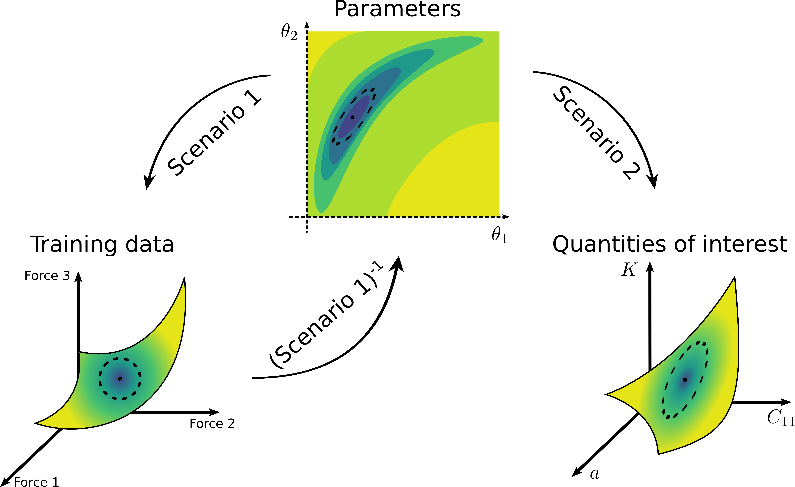
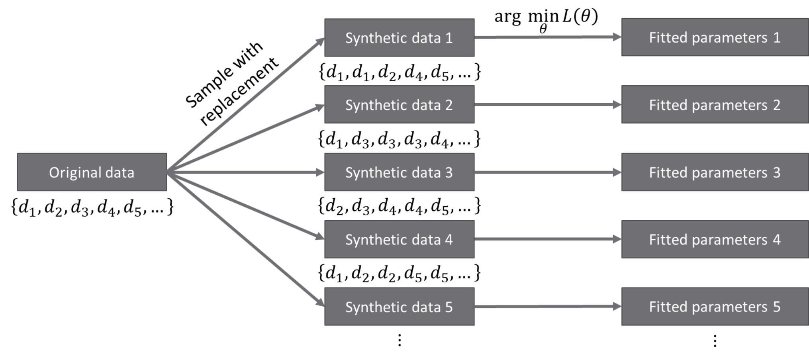

.. _doc.uq:

===============================
Uncertainty Quantification (UQ)
===============================

Uncertainty quantification (UQ) is an emerging field in applied mathematics that aims to
quantify uncertainties in mathematical models as a result of error propagation in the
modeling process. This is especially important since we use the model, i.e., the
potential, to predict material properties that are not used in the
training process. Thus, UQ process is especially important to assess the reliability of
these out-of-sample predictions.

   Illustration of general uncertainty quantification process. The error from the
   training data (represented by a dashed ellipse on the bottom left plot) is
   propagated to the uncertainty of the model's parameters (the ellipse in the middle
   plot). Then, the uncertainty of the parameters is propagated forward further to
   the uncertainty of the material properties of interest (the ellipse on the bottom
   right plot).

In UQ process, we first quantify the uncertainty of the model parameters (represented by
the dashed ellipse on the middle plot of the figure above). Having found the parametric
uncertainty, then we can propagate the uncertainty of the parameters and get the
uncertainty of the material properties of interest, e.g., by evaluating the ensemble that
is obtained from sampling the distribution of the parameters. As the first uncertainty
propagation is more involved, KLIFF implements tools to quantify the uncertainty of the
parameters.

In KLIFF, the UQ tools are implemented in :mod:`~kliff.uq`. In the current version, there
are 2 methods implemented: Bayesian MCMC sampling and bootstrapping, with the integration
of other UQ methods will be added in the future.

MCMC
====

The Bayesian Markov chain Monte Carlo (MCMC) is the UQ method of choice for interatomic
potentials. The distribution of the parameters is given by the posterior
:math:`P(\bm \theta | \bm q)`. By Bayes' theorem

.. math::

   P(\bm \theta | \bm q) \propto L(\bm \theta | \bm q) \times \pi(\bm \theta),

where :math:`L(\bm \theta | \bm q)` is the likelihood (which encodes the information
learned from the data) and :math:`\pi(\bm \theta)` is the prior distribution. Then, some
MCMC algorithm is used to sample the posterior and the distribution of the parameters is
inferred from the distribution of the resulting samples.

The likelihood function is given by

.. math::

   L(\bm \theta | \bm q) \propto \exp \left( -\frac{\mathcal{L}(\bm \theta)}{T} \right).

The inclusion of the sampling temperature :math:`T` is to account for model inadequacy,
or bias, in the potential [Kurniawan2022]_. Frederiksen et al. (2004) [Frederiksen2004]_
suggest estimating the bias by setting the temperature to

.. math::

   T_0 = \frac{2 \mathcal{L}_0}{N},

where :math:`\mathcal{L}_0` is the value of the loss function evaluated at the best fit
parameters and :math:`N` is the number of tunable parameters.

.. seealso::
   For more discussion about this formulation, see [KurniawanKLIFFUQ]_.

.. [Kurniawan2022]
   Kurniawan, Y., Petrie, C.L., Williams Jr., K.J., Transtrum, M.K., Tadmor, E.B.,
   Elliott, R.S., Karls, D.S., Wen, M., 2022. Bayesian, frequentist, and information
   geometric approaches to parametric uncertainty quantification of classical empirical
   interatomic potentials. J. Chem. Phys. https://doi.org/10.1063/5.0084988

.. [Frederiksen2004] S. L. Frederiksen, K. W. Jacobsen, K. S. Brown, and J. P.
   Sethna, “Bayesian Ensemble Approach to Error Estimation of Interatomic
   Potentials,” Phys. Rev. Lett., vol. 93, no. 16, p. 165501, Oct. 2004,
   doi: 10.1103/PhysRevLett.93.165501.

.. [KurniawanKLIFFUQ]
   Kurniawan, Y., Petrie, C.L., Transtrum, M.K., Tadmor, E.B., Elliott, R.S., Karls,
   D.S., Wen, M., 2022. Extending OpenKIM with an Uncertainty Quantification Toolkit for
   Molecular Modeling, in: 2022 IEEE 18th International Conference on E-Science
   (e-Science). Presented at the 2022 IEEE 18th International Conference on e-Science
   (e-Science), pp. 367–377. https://doi.org/10.1109/eScience55777.2022.00050

Implementation
--------------

For the MCMC sampling, KLIFF adopts parallel-tempered MCMC (PTMCMC) methods, via the
ptemcee_ Python package, as a way to perform MCMC sampling with several different
temperatures. Additionally, multiple parallel walkers are deployed for each sampling
temperature. PTMCMC has been widely used to improve the mixing rate of the sampling.
Furthermore, by sampling at several different temperatures, we can assess the effect of
the size of the bias to any conclusion drawn from the samples.

We start the UQ process by instantiating :class:`~kliff.uq.MCMC`,

.. code-block:: python

   from kliff.uq import MCMC

   loss = ...  # define the loss function
   sampler = MCMC(
       loss, nwalkers, logprior_fn, logprior_args, ntemps, Tmax_ratio, Tladder, **kwargs
   )

As a default, :class:`~kliff.uq.MCMC` inherits from ptemcee.Sampler_. The arguments to
instantiate the sampler are:

* ``loss``, which is a :class:`~kliff.loss.Loss` instance. This is a required argument
  to construct the untempered likelihood function (:math:`T=1`) and to compute
  :math:`T_0`.
* ``nwalkers`` specifies the number of parallel walkers to run for each sampling
  temperature. As a default, this quantity is set to twice the number of parameters in
  the model.
* ``logprior_fn`` argument allows the user to specify the prior distribution
  :math:`\pi(\theta)` to use. The function should accept an array of parameter values as
  input and compute the logarithm of the prior distribution. Note that the prior
  distribution doesn't need to be normalized. The default prior is a uniform distribution
  over a finite range. See the next argument on how to set the boundaries of the uniform
  prior.
* ``logprior_args`` is a tuple that contains additional positional arguments needed by
  ``logprior_fn``. If the default uniform prior is used, then the boundaries of the prior
  support (where :math:`\pi(\theta) > 0`) need to be specified here as a
  :math:`N \times 2` array, where the first and second columns of the array contain the
  lower and upper bound for each parameter.
* ``ntemps`` specifies the number of temperatures to simulate.
* ``Tmax_ratio`` is used to set the highest temperature by
  :math:`T_{\text{max}} = T_{\text{max\_ratio}} \times T_0`. An internal function is used
  to construct a list of logarithmically spaced ``ntemps`` points from 1.0 to
  :math:`T_{\text{max}}`, inclusive.
* ``Tladder`` allows user to specify a list of temperatures to use. This argument will
  overwrites ``ntemps`` and ``Tmax_ratio``.
* Other keyword arguments to be passed into ptemcee.Sampler_ needs to be specified in
  ``kwargs``.

.. How to run sampling
After the sampler is created, the MCMC run is done by calling
:meth:`~kliff.uq.MCMC.run_mcmc`.

.. code-block:: python

   p0 = ...  # Define the initial position of each walker
   sampler.run_mcmc(p0, iterations, *args, **kwargs)

The required arguments are:

* ``p0``, which is a :math:`K \times L \times N` array containing the position of each
  walker for each temperature in parameter space, where :math:`K`, :math:`L`, and
  :math:`N` are the number of temperatures, walkers, and parameters, respectively.
* ``iterations`` specifies the number of MCMC steps to take. Since the position of step
  :math:`i` in Markov chain only depends on step :math:`(i-1)`, it is possible to break
  up the MCMC run into smaller batches, with the note that the initial positions of the
  current run needs to be set to the last positions of the previous run.

.. seealso::
   For other possible arguments, see also ptemcee.Sampler.run_mcmc_.

The resulting chain can be retrieved via ``sampler.chain`` as a
:math:`K \times L \times M \times N` array, where :math:`M` is the total number of
iterations.

Parallelization
^^^^^^^^^^^^^^^

In principle, parallelization for the MCMC run can be done in 2 places: in the likelihood
(or loss function) evaluation for each parameter set (see :ref:`run_in_parallel`) and in
the likelihood evaluation across different walkers. In the current implementation we
supports OpenMP-style parallelization in the loss evaluation and both OpenMP and MPI for
the sampling for different walkers when running MCMC sampling.

In general, parallelization in the sampling process is done by declaring a pool and
setting it to ``sampler.pool`` prior to running MCMC, for example:

.. code-block:: python

   from multiprocessing import Pool
   
   sampler.pool = Pool(nprocs)  # nprocs is the number of parallel processes to use
   sampler.run_mcmc(p0, iterations, *args, **kwargs)

To do parallelization with MPI, we can utilize ``MPIPool`` from schwimmbad_:

.. code-block:: python

   from schwimmbad import MPIPool
   
   sampler.pool = MPIPool()
   sampler.run_mcmc(p0, iterations, *args, **kwargs)

and run the Python script with ``mpiexec`` bash command.

If enough compute resources are available, we can also employ a hybrid parallelization,
for example, using ``multiprocessing`` in the loss evaluation (by specifying the argument
``nprocs`` > 1) and MPI in the likelihood evaluation across different walkers. Then, we
can run the Python script as follows.

.. code-block:: bash

   $ export MPIEXEC_OPTIONS="--bind-to core --map-by slot:PE=<num_openmp_processes> port-bindings"
   $ mpiexec -np <num_mpi_workers> ${MPIEXEC_OPTIONS} python script.py

.. _ptemcee: https://github.com/willvousden/ptemcee/tree/1.0.0
.. _ptemcee.Sampler: https://github.com/willvousden/ptemcee/blob/1.0.0/ptemcee/sampler.py#L143-L199
.. _ptemcee.Sampler.run_mcmc: https://github.com/willvousden/ptemcee/blob/1.0.0/ptemcee/sampler.py#L272-L323
.. _schwimmbad: https://schwimmbad.readthedocs.io/

MCMC analysis
-------------

The chains from the MCMC simulation need to be processed. In a nutshell, the steps to
take are

* Estimate the burn-in time and discard it from the beginning of the chain,
* Estimate the autocorrelation length, :math:`\tau`, and only take every :math:`\tau` step
  from the remaining chain,
* Assess convergence of the samples, i.e., the remaining chain after the two steps above.

Burn-in time
^^^^^^^^^^^^

First, we need to discard the first few iterations at the beginning of each chain as a
burn-in time. This is similar to the equilibration time in a molecular dynamics
simulation before the measurement. This action also ensures that the result is independent
of the initial positions of the walkers.

KLIFF provides a function to estimate the burn-in time, based on the Marginal Standard
Error Rule (MSER). This can calculation can be done using the function
:func:`~kliff.uq.mcmc_utils.mser`. However, note that this calculation needs to be
performed for each temperature, walker, and parameter dimension separately.

Autocorrelation length
^^^^^^^^^^^^^^^^^^^^^^

In the Markov chain, the position at step :math:`i` is not independent of the previous
step. However, after several iterations (denote this number by :math:`\tau`, which is the
autocorrelation length), the walker will "forget" where it started, i.e., the position at
step :math:`i` is independent from step :math:`(i + \tau)`. Thus, we need to only keep
every :math:`\tau \text{-th}` step to obtain the independent, uncorrelated samples.

The estimation of the autocorrelation length in KLIFF is done via the function
:func:`~kliff.uq.mcmc_utils.autocorr`, which wraps over
``emcee.autocorr.integrated_time``. This calculation needs to be done for each temperature
independently. The required input argument is a :math:`L \times \tilde{M} \times N`
array, where :math:`L` and :math:`N` are the number of walkers and parameters,
respectively, and :math:`\tilde{M}` is the remaining number of iterations after
discarding the burn-in time.

Convergence
^^^^^^^^^^^

Finally, after a sufficient number of iterations, the distribution of the MCMC samples
will converge to the posterior. For multi-chain MCMC simulation, the convergence can be
assessed by calculating the multivariate potential scale reduction factor, denoted by
:math:`\hat{R}^p`. This quantity compares the variance between and within independent
chains. The value of :math:`\hat{R}^p` declines to 1 as the number of iterations goes to
infinity, with a common threshold is about 1.1.

In KLIFF, the function :func:`~kliff.uq.rhat` computes :math:`\hat{R}^p` for one
temperature. The required input argument is a :math:`L \times \tilde{M}^* \times N` array
of independent samples (:math:`\tilde{M}^*` is the number of independent samples in each
walker). When the resulting :math:`\hat{R}^p` values are larger than the threshold
(e.g., 1.1), then the MCMC simulation should be continued until this criterion is
satisfied.

.. note::
   Some sampling temperatures might converge at slower rates compared to others.
   So, user can terminate the MCMC simulation as long as the samples at the target
   temperatures, e.g., :math:`T_0`, have converged.

.. seealso::
   See the tutorial for running MCMC in :ref:`tut_mcmc`.

Bootstrap
=========

In general, the training dataset contains some random noise. When the data collection
process is repeated, we will not get the exact same values, but instead, we will get
(slightly) different values, where the deviation comes from the random noise. If we
train the model to fit different realizations of the training dataset, we will get a
distribution of the parameters. The uncertainty of the parameters from this distribution
gives how the error in the training data is propagated to the uncertainty of the
parameters. However, oftentimes we don't have the luxury to repeat the data collection.
A suggestion, in this case, is to generate artificial datasets and train the model to fit
these artificial datasets.

Bootstrapping is a way to generate artificial datasets. We assume that the original
dataset contains :math:`N` *independent and identically distributed (iid)* data points.
An artificial, bootstrap dataset is generated by sample :math:`M` points from the original
dataset with replacement. Note that this means that there are some data points that are
repeated, while some other data points are not sampled, thus the bootstrap dataset is not
the same as the original dataset. The difference between the datasets gives a sense of
probability in data.

.. note::
   Although usually :math:`M` is set to be the same as :math:`N`, in principle it
   doesn't need to be.

Implementation
--------------

Bootstrapping is implemented in :class:`~kliff.uq.Bootstrap`. A general workflow for this
calculation is

1. Instantiate :class:`~kliff.uq.Bootstrap` class instance.

   This process is straightforward. The only required argument is the :class:`~kliff.loss.Loss`
   instance.

   .. code-block:: python

      from kliff.uq import Bootstrap

      loss = ...  # define the loss function
      # Train the potential
      min_kwargs = ...  # Optimizer setting
      loss.minimize(**min_kwargs)

      bs = Bootstrap(loss, *args, **kwargs)

   When instantiating the parent class :class:`~kliff.uq.Bootstrap`, it will return either
   an instance of :class:`~kliff.uq.BootstrapEmpiricalModel` or
   :class:`~kliff.uq.BootstrapNeuralNetworkModel`, depending on whether we have a
   physics-based (empirical) model or a neural network model, respectively. When a neural
   network model is used, the user can specify an additional argument `orig_state_filename`,
   which specified the name and path of the file to use to export the initial state of the
   model prior to running bootstrap. This is to reset the state of the model at the end
   of performing bootstrap UQ.

2. Generate bootstrap datasets.

   In this implementation, we assume that the training dataset consists of many atomic
   configurations and the corresponding quantities. Note that the quantities corresponding
   to a single atomic configuration are **not** independent of each other. Thus, the
   resampling process to generate a bootstrap dataset should not be done at the data point
   level. Instead, we should generate a bootstrap dataset by resampling the atomic
   configurations.

   The built-in bootstrap dataset generator function was set up to perform this type of
   resampling. Note that atomic configurations here are referred to as compute arguments,
   which also contain the type of data and weights to use.

   .. code-block:: python

      nsamples = ...  # Number of samples to generate
      bs.generate_bootstrap_compute_arguments(nsamples)

   When an empirical model with multiple calculators is used, the resampling is done to
   the combined list of the compute arguments across all calculators. Then, an internal
   function will automatically assign back the bootstrap compute arguments to their
   respective calculators. This means that the number of compute arguments in each
   calculator when we do bootstrapping is more likely to be different than the original
   number of compute arguments per calculator, although the total number of compute
   arguments is still the same.

   Also, note that the built-in bootstrap compute arguments generator assumes that the
   configurations are independent of each other. In the case where this is not satisfied,
   then a more sophisticated resampling method should be used. This can be done by
   defining a custom bootstrap compute arguments generator function. The only required
   argument for this function is the requested number of samples.

3. Run the optimization for each bootstrap dataset.

   After a set of bootstrap compute arguments is generated, then we need to iterate over
   each of them, and train the potential to fit each bootstrap dataset.

   .. code-block:: python

      bs.run(min_kwargs=min_kwargs)

   There are 2 arguments that are the same to run the optimization stage of bootstrapping,
   regardless if we use an empirical or neural network model. These arguments are:

   * ``min_kwargs``, which is a dictionary containing the keyword arguments that will be
     passed into the optimizer. This argument can be thought of as the optimizer setting.

     .. note::
	Since the mapping from the bootstrap dataset to the inferred parameters contains
	optimization, then it is recommended to use the same optimizer setting when we
	iterate over each bootstrap compute argument and train the potential.
	Additionally, the optimizer setting should also be the same as the setting used
	in the initial training, when we use the original set of compute arguments to
	train the potential.

   * ``callback``, which is an option to specify a function that will be called in each
     iteration. This can be used as a debugging tool or to monitor convergence.

   For other additional arguments, please refer to the respective function documentation,
   i.e., :meth:`~kliff.uq.BootstrapEmpiricalModel.run` for an empirical model or
   :meth:`~kliff.uq.BootstrapNeuralNetworkModel.run` for neural network model.
