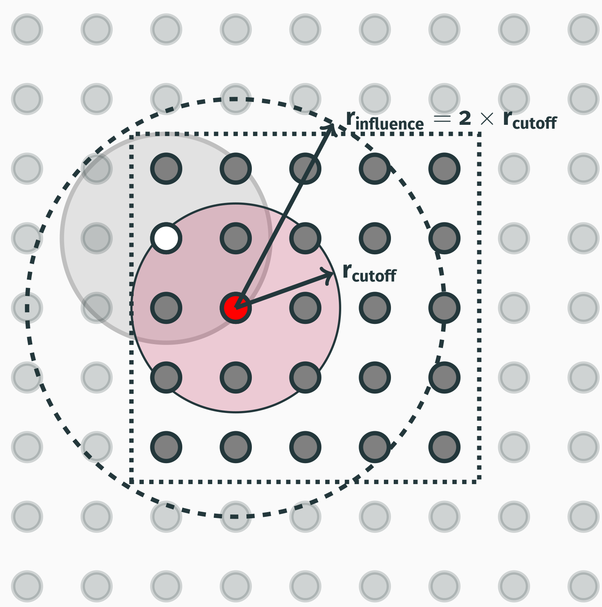
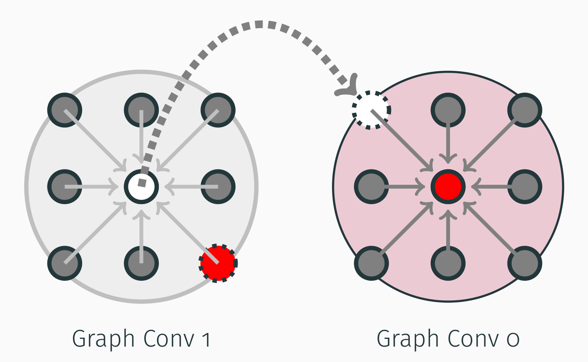

Graph Convolutions in KLIFF
===========================
Velow is major differences between the staged graph convolutions and minimum image
convention like graph convolutions (cyclic convolution). KLIFF now supports both approaches,
but KIM-API only allows staged graph convolutions for GNN.

Cyclic graph convolutions (MIC)
-------------------------------

Most conventional GNNs use convolutional layers that pass messages between atoms, and
they look like

.. code-block::python

    for i in range(n_conv):
        h = graph_conv(h, edge_index)

where ``h`` is the atom embeddings, and ``edge_index`` defines the edge connections between atoms.
The ``graph_conv`` function is a convolutional layer that takes the atom embeddings and the
edge connections, and returns the updated atom embeddings.

Here the input of one model layer is the output of the previous layer, and this in effect
propagates the influence sphere/information from atoms far beyond the cutoff distance.
This is at odds with KIM API design philosophy, since this influence now has a “non-local”
component: the feature of atom ``i`` is influenced by the feature of atom ``j``, and the
feature of atom ``j`` is influenced by the feature of atom ``k``, yet atom ``k`` is beyond
the cutoff distance from atom ``i``.

Staged graph convolutions
-------------------------

To mitigate such problems in conventional interatomic potentials, the KIM API provides two
distances that the user can define: the cutoff distance and the influence distance.
Therefore, in the current implementation of the TorchML model driver, the GNN model must
use the influence distance to limit its influence sphere. The influence distance for a
GNN is defined as :math:`r_{infl} = n_{conv} \times r_{cutoff}`
(see figure below for an example with :math:`n_{conv} = 2`).

This poses challenges in constructing the model, as the model must now use different sets
of superseding edge graphs to correctly perform the multiple message‐passing steps above.
In essence, the convolutions must look like

.. code-block:: python

    h = graph_conv(h, edge_index1)  # convolve with r_cutoff * 2 sphere of atoms, r_infl
    h = graph_conv(h, edge_index0)  # final convolution with r_cutoff sphere of atoms

Please pay attention to the inverse order of convolution, where the first convolution is
over the entire sphere of influence, and the last convolution is over the cutoff sphere.
Here, ``edge_index1`` is the graph for all atoms in the influence sphere (first convolution,
gray circle, labelled "Graph Conv 1" on the left in the figure below), and ``edge_index0``
is the graph for all atoms in the cutoff-distance sphere (red circle on the right).

.. tip::

    Please note the red central atom in the left (gray) circle: it indicates that the
    red atom is within the cutoff distance of the white atom, hence for the first convolution
    it contributes to the feature of the white atom. In the second convolution this summed‐up
    feature contributes back to the feature of the red atom, thus giving an equivalent
    representation to the cyclic graph convolutions.

Periodic boundary conditions in both approaches
-----------------------------------------------

The GNN model must compute correct edge vectors and distances compensated for the lattice
vectors. A trivial implementation looks like

.. code-block:: python

    temp_r_ij = r_i - r_j
    if all(temp_r_ij @ lattice_vectors < box_dims):
        r_ij = temp_r_ij
    else:
        r_ij = temp_r_ij - mask(temp_r_ij @ lattice_vectors) * lattice_vectors
    h_i = phi_h(h_i, h_j)  # compute message

This approach requires passing ``lattice_vectors`` and ``box_dims`` to the model, which
the KIM API does not allow. The model must compute edge vectors and distances without
explicit lattice vectors. It turns out the staged‐graph approach helps here too.
As it is purely based on influence distance, all atoms needed for edge‐vector computation
are already “unwrapped,” so you can simply do

.. code-block::python

    r_ij = r_i - r_j
    if distance(r_ij) < cutoff:
        h_i = phi_h(h_i, h_j)  # compute message

Thus staged graph convolutions are enough to make a GNN‐based interatomic potential local
and compatible with the KIM API. A major added benefit is that staged graph convolutions
are inherently domain‐decomposable and parallel, so they scale to massive simulations.
